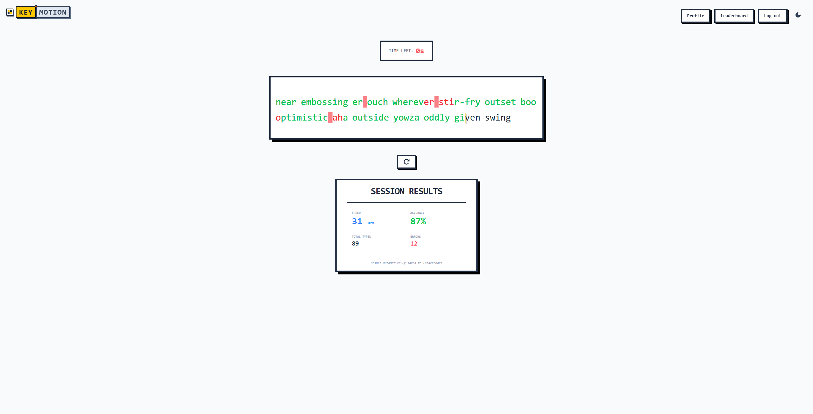

# KeyMotion

**KeyMotion** is a lightweight and interactive typing speed test application designed to help users improve their typing efficiency with a smooth, modern user experience.

<p align="center">
  
</p>

## Live Demo

- **Frontend**: [https://key-motion.vercel.app/](https://key-motion.vercel.app/) (Vercel)
- **Backend API**: [https://keymotion-production.up.railway.app](https://keymotion-production.up.railway.app) (Railway)

## Features

1.  **User Account**: Register and login with JWT authentication. Track your progress and view your profile.
2.  **Leaderboard**: Compete with others and see rankings by best WPM.
3.  **Flexible Test Duration**: Choose between **30s, 60s, or 90s** test modes. The game starts instantly upon your first keystroke.
4.  **Real-time Visual Feedback**:
    *   **Smooth Caret Motion**: Features a fluid, animated caret using `framer-motion` that glides as you type.
    *   **Accuracy Highlighting**: Correct characters are marked clearly, while errors are highlighted to provide immediate feedback.
5.  **Dynamic Word Generation**: Never run out of practice material—new words are automatically generated as you complete each set.
6.  **Comprehensive Results**: At the end of each session, view detailed statistics including:
    *   **WPM** (Words Per Minute)
    *   **Accuracy Percentage**
    *   **Total Errors**
    *   **Total Characters Typed**
7.  **Interactive Elements**:
    *   **Sound Effects**: Satisfying feedback sounds for keystrokes, errors, and UI interactions (with sound toggle).
    *   **Theme Support**: Toggle between Light and Dark modes to suit your preference.
    *   **Quick Restart**: Instantly reset the test at any time with the dedicated restart button.

## Tech Stack

### Frontend
*   **React** - UI Library
*   **TypeScript** - Type Safety
*   **Tailwind CSS** - Styling
*   **Framer Motion** - Animations
*   **Vite** - Build Tool

### Backend
*   **NestJS** - Server Framework
*   **Prisma** - ORM
*   **PostgreSQL** - Database
*   **JWT** - Authentication

## Getting Started

To run KeyMotion locally on your machine:

1.  **Clone the repository:**
    ```bash
    git clone https://github.com/LuvsicptZ/KeyMotion.git
    cd KeyMotion
    ```

2.  **Start the frontend:**
    ```bash
    cd frontend
    npm install
    npm run dev
    ```

3.  **Start the backend:**
    ```bash
    cd backend
    npm install
    # Create .env with DATABASE_URL and JWT_SECRET (see backend/README.md)
    npx prisma migrate dev   # Run database migrations
    npm run start:dev
    ```

4.  **Open in browser:**
    Navigate to `http://localhost:5173` (or the port shown in your terminal).

## How to Play

1.  **Select Time**: Click on 30s, 60s, or 90s to set your timer.
2.  **Start Typing**: The timer begins automatically when you type the first character.
3.  **Keep Going**: Type the words shown on screen. If you finish the current set, a new set will appear.
4.  **View Results**: When time runs out, check your WPM and accuracy!

## License

This project is open source and available under the [MIT License](LICENSE).
